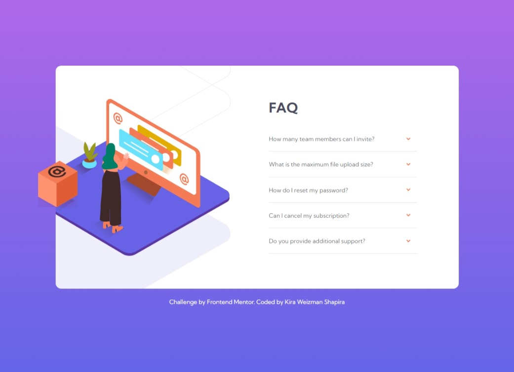

# Frontend Mentor - FAQ accordion card

## Welcome! 👋

Thank you for taking the time to review this front-end coding challenge.

For this challenge, I followed a YouTube tutorial by Seer Studio [Seer Studio](https://www.youtube.com/watch?v=mLZGpEHgOO8&t=1513s) to learn how to implement an accordion function using JavaScript. Since I am new to JavaScript, the tutorial was helpful in teaching me the necessary skills. Moving forward, I plan to explore more advanced topics and experiment with different techniques for creating an accordion function.

Alongside learning about the accordion element, I also gained knowledge about positioning elements using the "position: relative" property. This included understanding how to position an image relative to its parent container and how to place an object at a specific point on the page using the "transform: translate" property. Additionally, I learned how to adjust the image size uniformly and make it responsive to different screen sizes.

You can view the challenge here [FAQ accordion card challenge on Frontend Mentor](https://www.frontendmentor.io/challenges/faq-accordion-card-XlyjD0Oam)

### Built with

- Semantic HTML5 markup
- CSS custom properties
- CSS Grid
- Mobile-first workflow

## Author

Coded by [@kirawesh](https://www.frontendmentor.io/profile/kirawesh)